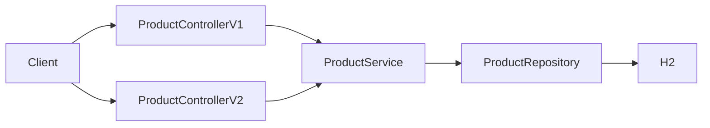

# Migration Demo

Demo application for migrating from Spring Boot 3.5 to Spring Boot 4. The app currently runs on Spring Boot 3.5 and is intended as a baseline for a future upgrade to Spring Boot 4.

## Prerequisites

- Java 25
- Gradle (or use the included wrapper: `./gradlew`)

## Tech stack

- Spring Boot 3.5
- Spring Web, Data JPA, Validation, Actuator
- Spring Cloud Resilience4j
- SpringDoc OpenAPI (Swagger UI)
- H2 (in-memory database)
- Lombok

## Getting started

```bash
./gradlew bootRun
```

Run tests:

```bash
./gradlew test
```

## API overview

| Method | Endpoint | Description |
|--------|----------|-------------|
| GET | `/api/v1/products` | Returns a list of product names |
| GET | `/api/v1/products/{id}` | Returns a specific product by ID |
| POST | `/api/v1/products` | Creates a product |
| GET | `/api/v2/products` | Returns a list of products (name, price) |
| GET | `/api/v2/products/{id}` | Returns a specific product by ID |
| POST | `/api/v2/products` | Creates a product |

**Create product** (v1 or v2): send a JSON body:

```json
{ "name": "Product name", "price": 9.99 }
```

API documentation is available via Swagger UI at `/swagger-ui.html` when the application is running.

## Error Handling

The application implements a global exception handler using `@RestControllerAdvice` that follows the **RFC 7807 Problem Details** standard. All error responses include:

- `type`: URI reference identifying the problem type
- `title`: Short, human-readable summary
- `status`: HTTP status code
- `detail`: Human-readable explanation
- `instance`: URI reference identifying the specific occurrence
- `timestamp`: When the error occurred

### Example Error Response (404 Not Found)

```json
{
  "type": "about:blank",
  "title": "Not Found",
  "status": 404,
  "detail": "Product not found with id: 123e4567-e89b-12d3-a456-426614174000",
  "instance": "/api/v1/products/123e4567-e89b-12d3-a456-426614174000",
  "timestamp": "2026-03-17T10:30:00",
  "errors": {}
}
```

### Example Validation Error Response (400 Bad Request)

```json
{
  "type": "about:blank",
  "title": "Validation Failed",
  "status": 400,
  "detail": "Request validation failed. Check the validationErrors field for details.",
  "instance": "/api/v1/products",
  "timestamp": "2026-03-17T10:30:00",
  "validationErrors": {
    "name": "must not be blank",
    "price": "must be greater than 0"
  }
}
```

### Supported Error Types

- **400 Bad Request**: Validation errors (invalid input)
- **404 Not Found**: Resource not found (e.g., product by ID)
- **405 Method Not Allowed**: Unsupported HTTP method
- **500 Internal Server Error**: Unexpected server errors
- **503 Service Unavailable**: Service temporarily unavailable (resilience fallback)

## Request flow



## Project structure

```
src/main/java/com/felipestanzani/migrationdemo/
├── MigrationdemoApplication.java   # Main application class
├── component/
│   └── CustomHealthIndicator.java  # Custom health check
├── config/
│   └── OpenApiConfig.java           # Swagger/OpenAPI configuration
├── controller/
│   ├── ProductControllerV1.java     # API v1: product names
│   └── ProductControllerV2.java     # API v2: full product responses
├── dto/
│   ├── ErrorResponse.java           # RFC 7807 error response
│   ├── ProductRequest.java
│   ├── ProductResponse.java
│   └── ValidationErrorResponse.java # Validation error response
├── exception/
│   ├── ForcedFallbackException.java # Resilience4j fallback exception
│   ├── GlobalExceptionHandler.java  # @RestControllerAdvice handler
│   └── ProductNotFoundException.java # Custom business exception
├── model/
│   └── Product.java
├── repository/
│   └── ProductRepository.java
└── service/
    ├── interfaces/
    │   └── ProductService.java
    └── ProductServiceImpl.java
```

## License

This project is licensed under the MIT License. See [LICENSE.md](LICENSE.md) for details.
